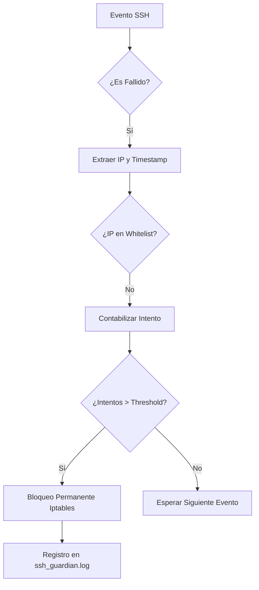

# 🛡️ Especificación Técnica: SSH Guardian IPS
### **Sistema de Prevención de Intrusiones Ligero para Servidores Linux**

## 1. Resumen Ejecutivo
**SSH Guardian** es una solución de Seguridad Operativa (SecOps) diseñada para mitigar ataques de fuerza bruta sobre el servicio OpenSSH en entornos **Ubuntu 22.04/24.04 LTS**. A diferencia de soluciones más pesadas, SSH Guardian se enfoca en la eficiencia extrema (~5.5 MB RAM) y la respuesta inmediata mediante la manipulación directa de reglas de filtrado a nivel de Kernel (Netfilter/Iptables).

---

## 2. Arquitectura del Sistema
El sistema opera bajo un modelo de **Análisis de Eventos Basado en Host (HIDS)**:

* **Ingesta de Datos:** Monitoreo pasivo del flujo de eventos en `/var/log/auth.log`.
* **Motor de Correlación:** Identifica patrones de denegación de acceso (`Failed password`, `Invalid user`) y procesa metadatos del sistema (repeticiones de mensajes).
* **Capa de Decisión:** Evalúa si la IP atacante supera el umbral de agresividad en la ventana de tiempo definida.
* **Capa de Aplicación:** Ejecuta comandos de sistema para inyectar reglas `DROP` en la cadena `INPUT` de Iptables.

### Diagrama de Flujo Lógico


---

## 3. Especificaciones Técnicas

| Parámetro | Detalle |
| --- | --- |
| **Lenguaje de Programación** | Python 3.x (Standard Library) |
| **Mecanismo de Bloqueo** | Iptables (Target: DROP) |
| **Huella de Memoria** | ~5.5 MB RAM |
| **Compatibilidad** | Ubuntu 22.04 / 24.04 LTS |
| **Persistencia** | Systemd Service (Restart on Failure) |

---

## 4. Implementación y Hardening (Endurecimiento)

Para garantizar la integridad del IPS, se aplican medidas de endurecimiento de archivos (File Hardening):

* **Script Principal:** `/usr/local/bin/ssh_guardian.py` (Permisos `700` - Solo Root).
* **Bitácora de Auditoría:** `/var/log/ssh_guardian.log` (Permisos `640` - Lectura administrativa).

### Gestión de Servicio (Systemd)

El ciclo de vida del proceso es gestionado por un archivo de unidad de Systemd, asegurando que el monitoreo se inicie inmediatamente después de que la red esté disponible.

```ini
[Unit]
Description=SSH Guardian IPS Service
After=network.target

[Service]
ExecStart=/usr/bin/python3 /usr/local/bin/ssh_guardian.py
Restart=always
User=root

[Install]
WantedBy=multi-user.target

```

---

## 5. Guía de Operación (Playbook)

### Gestión de Reglas de Firewall

Para listar las direcciones IP que han sido neutralizadas por el sistema:

```bash
sudo iptables -L INPUT -n --line-numbers | grep DROP

```

### Gestión de Falsos Positivos (Whitelist)

Si una IP legítima requiere ser desbloqueada, identifique su número de línea y ejecute:

```bash
sudo iptables -D INPUT [LINE_NUMBER]

```

> **Nota:** Se recomienda añadir las IPs de administración directamente en la variable `WHITELIST` dentro del script para evitar bloqueos accidentales.

---

## 6. Análisis de Riesgos y Limitaciones

* **Volatilidad:** Las reglas de Iptables se pierden tras un reinicio a menos que se utilice `iptables-persistent`.
* **IPv6:** La versión actual está optimizada para el stack IPv4. Se recomienda expandir a `ip6tables` en entornos dual-stack.
* **Logs:** El sistema depende de la disponibilidad de `auth.log`. Si el servicio `rsyslog` se detiene, el IPS queda cegado.
